# GapScan

An AI-powered Resume Analysis platform that evaluates resumes against ATS best practices and provides actionable feedback on content quality, structure, skills coverage, and writing style.

GapScan allows candidates to upload resumes, receive AI-generated recommendations, track historical submissions, and improve their chances of passing Applicant Tracking Systems (ATS).

---

# Overview

GapScan consists of two independent applications:

1. **Frontend**
   - React Router 7
   - TypeScript
   - Zustand
   - Puter Authentication
   - PDF Processing
   - Resume Management UI

2. **Backend**
   - Node.js
   - Express
   - AWS S3 Integration
   - File Upload APIs
   - Signed URL Generation
   - S3 Cleanup APIs

---

# Architecture
:TODO

---

# Tech Stack
- React 19
- Tailwind CSS
- Zustand State Management
- Puter Auth
- Puter AI for Ai Integration. At this case using the puter default gpt-5-nano
- pdfjs-dist
- Dropzone
- Node.js 20
- Express 5
- @aws-sdk/client-s3
- @aws-sdk/s3-request-presigner
---

## Application Wipe Utility
Developer utility route:
```text
/wipe
```
Performs:
- Resume history cleanup
- Local storage cleanup
- S3 object deletion
Useful during development and testing.
---

# Project Structure
```text
GapScan
│
├── frontend
│   │
│   ├── app
│   │   ├── components
│   │   ├── routes
│   │   ├── lib
│   │   └── root.tsx
│   │
│   ├── public
│   ├── package.json
│   └── Dockerfile
│
├── server
│   │
│   ├── routes
│   │   ├── upload.ts
│   │   └── wipe.ts
│   │
│   ├── server.ts
│   ├── package.json
│   └── Dockerfile
│
└── README.md
```
---

# Environment Variables
## Frontend
```bash
frontend/.env
```
```env
VITE_API_URL=http://localhost:5001
```
---

## Backend
```bash
server/.env
```

```env
AWS_REGION=us-east-1
AWS_ACCESS_KEY_ID=xxxxxxxx
AWS_SECRET_ACCESS_KEY=xxxxxxxx
S3_BUCKET_NAME=resume-storage-xxxxxxxx
```
---

# Local Development
## Start Backend
```bash
cd server
npm install
npm run dev
```

API:
```text
http://localhost:5001
```

---
## Start Frontend

```bash
cd frontend
npm install
npm run dev
```

Application:
```text
http://localhost:5173
```

---
# Docker Deployment
## Frontend
Build:
```bash
docker build -t gapscan-frontend .
```

Run:
```bash
docker run \
-p 3000:3000 \
--env-file .env \
gapscan-frontend
```
---

## Backend
Build:
```bash
docker build -t gapscan-backend .
```

Run:
```bash
docker run \
-p 5001:5001 \
--env-file .env \
gapscan-backend
```
---


## Photo Demo:

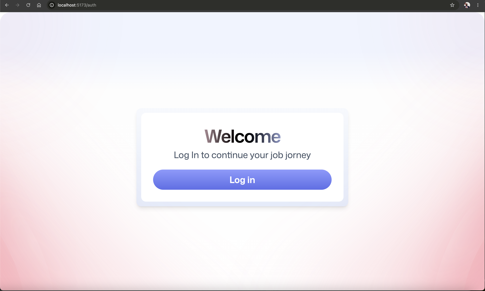

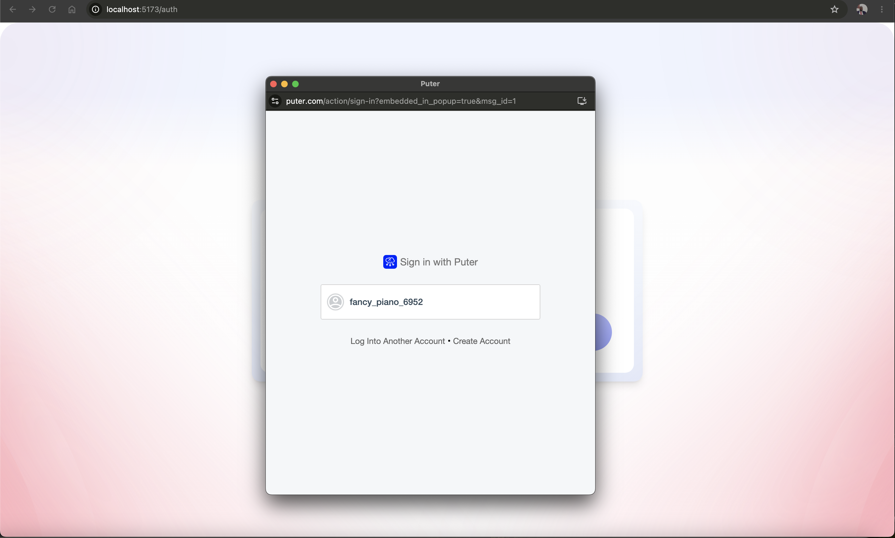

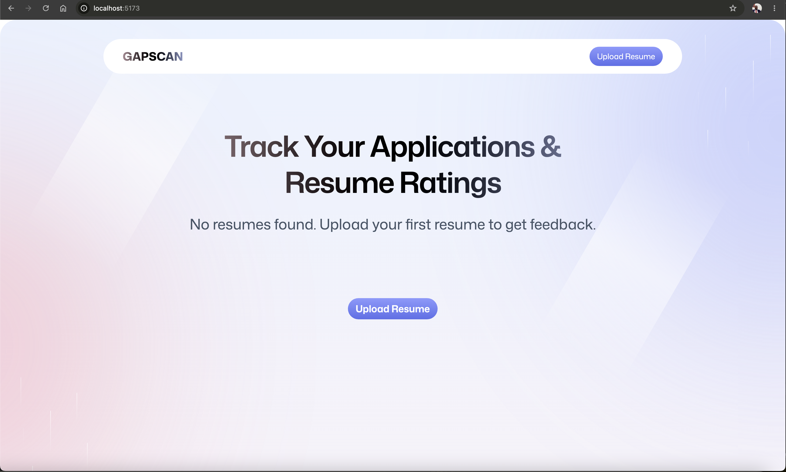

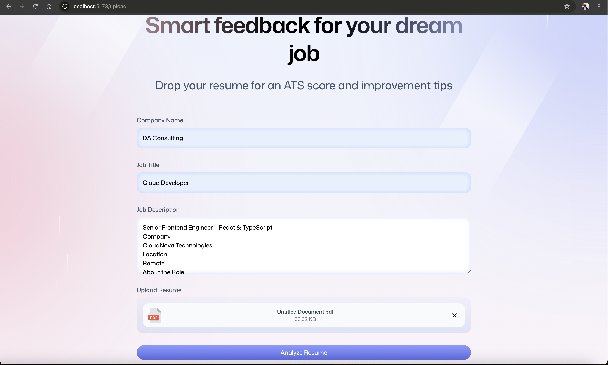

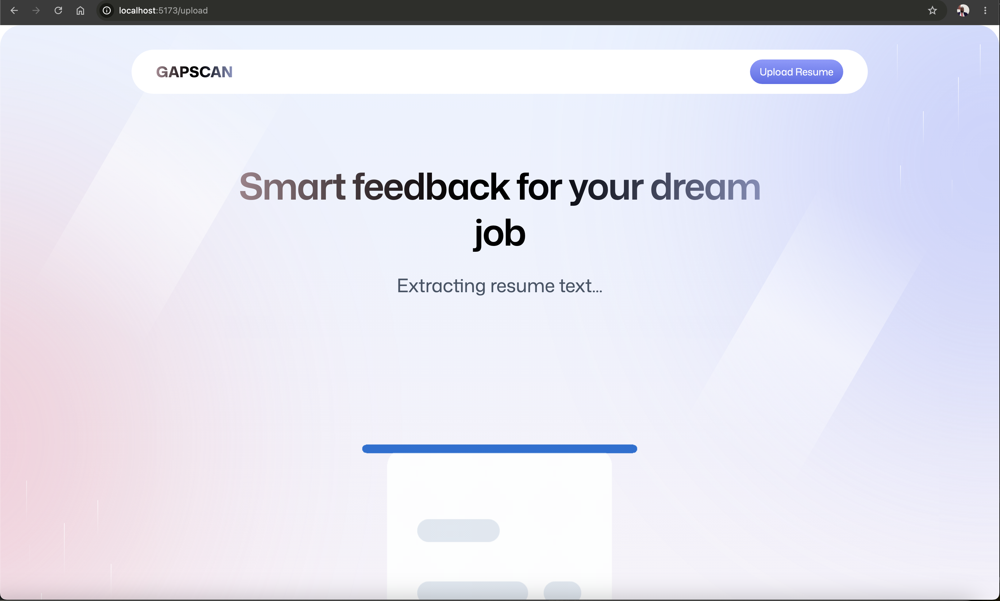


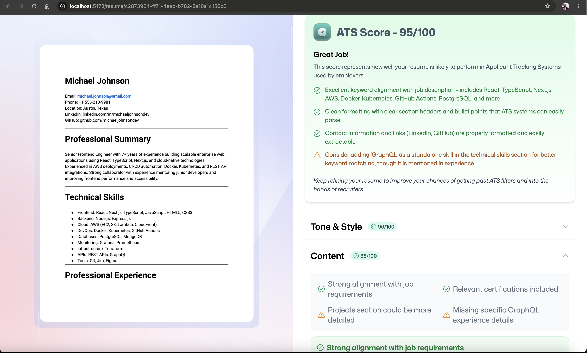

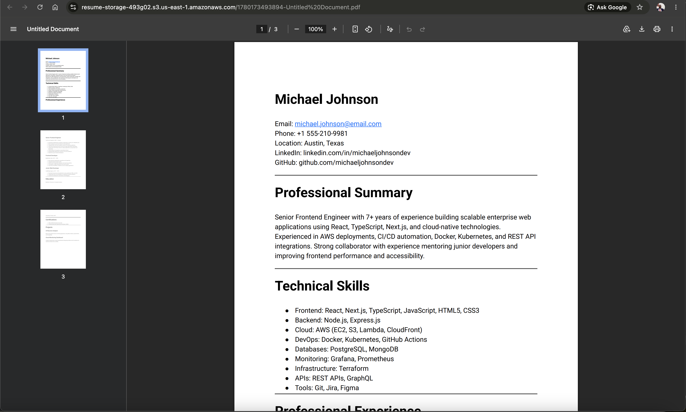

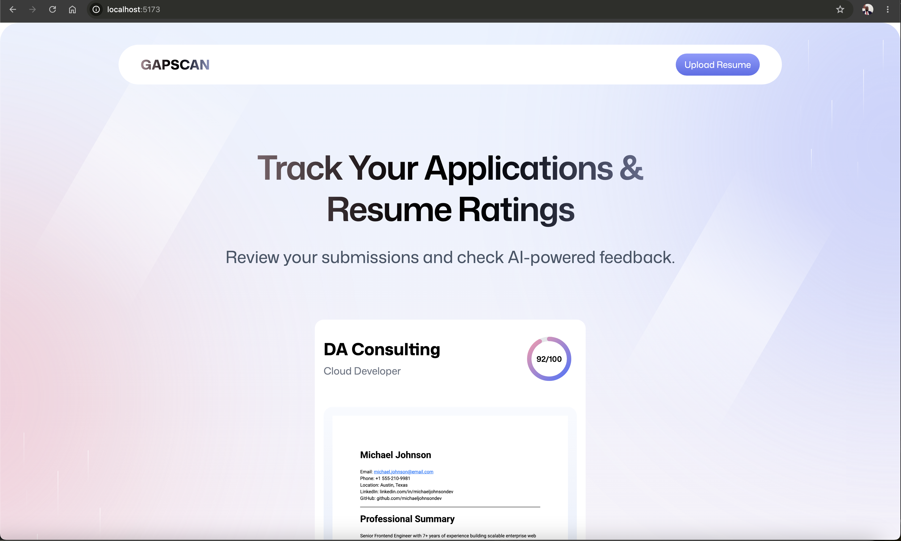

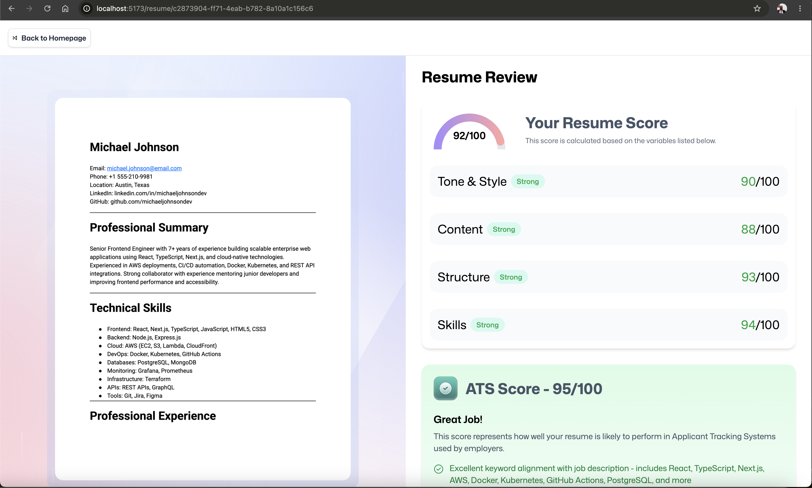

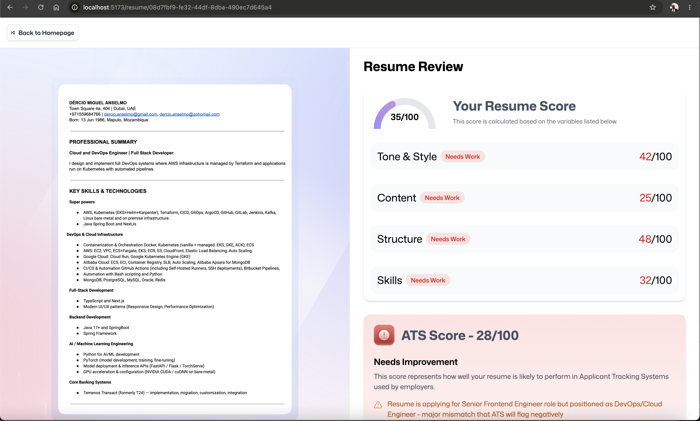

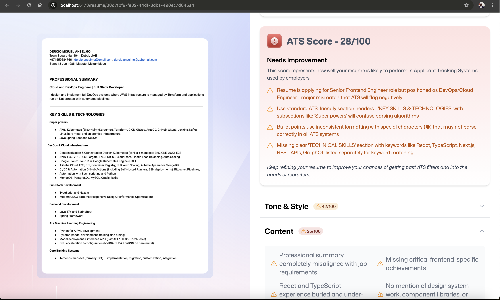

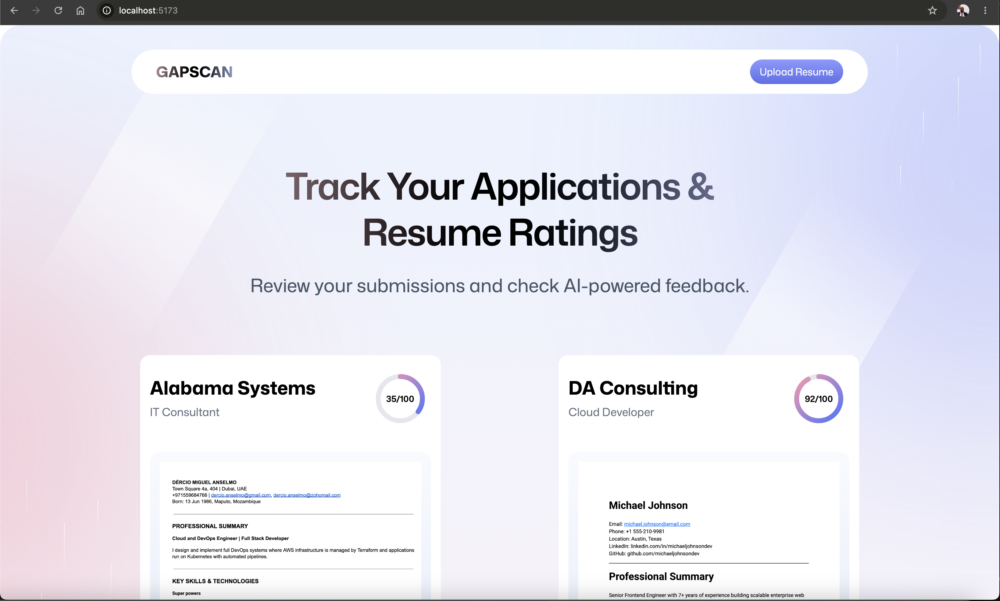


## Next Stage
Deploy LLAma locally and use it to avoid usage limit 